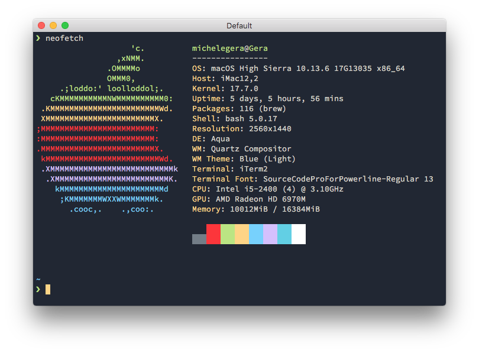

# iTerm2 Ayu Mirage
[Ayu](https://github.com/ayu-theme) Mirage color theme for
[iTerm2](https://www.iterm2.com/)

## Screenshot

## How to install
1. `iTerm2` > `Preferences` > `Profiles` > `Colors`
2. Open the `Color Presets…` drop-down in the bottom right corner
3. Select `Import…` from the list
4. Select the `Ayu Mirage.itermcolors` file
5. Select `Ayu Mirage` from `Color Presets…`
